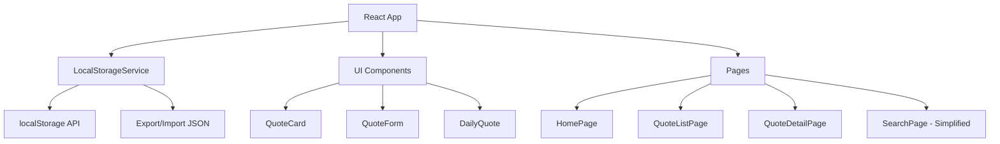

# Design Document: localStorage-version

## Visão Geral

Conversão do Diário Filosófico para funcionar 100% no frontend usando localStorage, eliminando a dependência do backend. Esta solução permite hospedagem gratuita em plataformas como Vercel, Netlify ou GitHub Pages, resolvendo o problema de bloqueio do Supabase em serviços gratuitos como Render e PythonAnywhere.

**Objetivo**: Criar uma versão standalone que mantém todas as funcionalidades essenciais (CRUD de citações, tags, busca textual, citação diária, exportação) enquanto remove funcionalidades complexas que dependem do backend (busca semântica, embeddings, gráfico de conexões).

## Arquitetura



## Componentes e Interfaces

### Component 1: LocalStorageService

**Propósito**: Gerenciar todas as operações de dados no localStorage, substituindo completamente as chamadas à API REST.

**Interface**:
```typescript
interface LocalStorageService {
  // Quotes
  getAllQuotes(): Quote[]
  getQuote(id: string): Quote | null
  createQuote(data: CreateQuoteData): Quote
  updateQuote(id: string, data: UpdateQuoteData): Quote
  deleteQuote(id: string): void
  getDailyQuote(): Quote | null
  searchQuotes(query: string): Quote[]
  
  // Tags
  getAllTags(): Tag[]
  getTag(id: string): Tag | null
  createTag(name: string, color: string): Tag
  updateTag(id: string, data: UpdateTagData): Tag
  deleteTag(id: string): void
  
  // Data management
  exportData(): string
  importData(jsonData: string): void
  clearAllData(): void
  getStorageStats(): StorageStats
}
```

**Responsabilidades**:
- Gerenciar estrutura de dados no localStorage
- Implementar busca textual simples
- Gerar IDs únicos para quotes e tags
- Manter contadores de tags atualizados
- Validar integridade dos dados
- Fornecer funcionalidades de export/import

### Component 2: useLocalQuotes Hook

**Propósito**: Hook React que substitui o useQuotes atual, fornecendo interface compatível com React Query mas usando localStorage.

**Interface**:
```typescript
interface UseLocalQuotesReturn {
  data: PaginatedQuotes | undefined
  isLoading: boolean
  isError: boolean
  refetch: () => void
}

function useLocalQuotes(page: number): UseLocalQuotesReturn
function useLocalQuote(id: string): { data: Quote | undefined; isLoading: boolean; isError: boolean }
function useLocalTags(): { data: Tag[]; isLoading: boolean; isError: boolean }
function useLocalDailyQuote(): { data: Quote | undefined; isLoading: boolean; isError: boolean }
function useLocalSearch(query: string): { data: Quote[]; isLoading: boolean; isError: boolean }
```

**Responsabilidades**:
- Fornecer interface compatível com hooks existentes
- Gerenciar estado local com useState/useEffect
- Simular comportamento assíncrono quando necessário
- Disparar re-renders quando dados mudam

### Component 3: ExportImportManager

**Propósito**: Componente UI para gerenciar exportação e importação de dados.

**Interface**:
```typescript
interface ExportImportManagerProps {
  onExport: () => void
  onImport: (file: File) => void
  storageStats: StorageStats
}
```

**Responsabilidades**:
- Botão de exportar dados (download JSON)
- Input de importar dados (upload JSON)
- Exibir estatísticas de armazenamento
- Validar dados importados
- Confirmar operações destrutivas

## Modelos de Dados

### Model 1: LocalStorageData

```typescript
interface LocalStorageData {
  quotes: Quote[]
  tags: Tag[]
  nextQuoteId: number
  nextTagId: number
  version: string
  lastModified: string
}
```

**Regras de Validação**:
- version deve seguir semver (ex: "1.0.0")
- nextQuoteId e nextTagId devem ser números positivos
- quotes e tags devem ser arrays válidos
- lastModified deve ser ISO 8601 timestamp

### Model 2: StorageStats

```typescript
interface StorageStats {
  quotesCount: number
  tagsCount: number
  storageUsed: number
  storageLimit: number
  lastBackup: string | null
}
```

**Regras de Validação**:
- Todos os contadores devem ser não-negativos
- storageUsed não pode exceder storageLimit
- lastBackup deve ser ISO 8601 timestamp ou null

### Model 3: CreateQuoteData

```typescript
interface CreateQuoteData {
  text: string
  author: string
  work?: string
  reflection?: string
  tagIds: string[]
  isFavorite: boolean
}
```

**Regras de Validação**:
- text: obrigatório, mínimo 10 caracteres
- author: obrigatório, mínimo 2 caracteres
- work: opcional, máximo 200 caracteres
- reflection: opcional, máximo 2000 caracteres
- tagIds: array de IDs válidos existentes
- isFavorite: boolean

## Algoritmos Principais

### Algoritmo 1: Busca Textual Simples

```typescript
ALGORITHM searchQuotes(query)
INPUT: query (string de busca)
OUTPUT: quotes (array de Quote)

BEGIN
  ASSERT query is not null
  
  // Normalizar query
  normalizedQuery ← query.toLowerCase().trim()
  
  IF normalizedQuery.length = 0 THEN
    RETURN []
  END IF
  
  // Obter todas as citações
  allQuotes ← getAllQuotes()
  results ← []
  
  // Buscar em cada citação
  FOR each quote IN allQuotes DO
    // Buscar em texto, autor, obra e reflexão
    textMatch ← quote.text.toLowerCase().includes(normalizedQuery)
    authorMatch ← quote.author.toLowerCase().includes(normalizedQuery)
    workMatch ← quote.work?.toLowerCase().includes(normalizedQuery) OR false
    reflectionMatch ← quote.reflection?.toLowerCase().includes(normalizedQuery) OR false
    
    // Buscar em tags
    tagMatch ← false
    FOR each tag IN quote.tags DO
      IF tag.name.toLowerCase().includes(normalizedQuery) THEN
        tagMatch ← true
        BREAK
      END IF
    END FOR
    
    // Se encontrou em qualquer campo, adicionar aos resultados
    IF textMatch OR authorMatch OR workMatch OR reflectionMatch OR tagMatch THEN
      results.add(quote)
    END IF
  END FOR
  
  RETURN results
END
```

**Precondições**:
- query é uma string válida (não null/undefined)
- localStorage contém dados válidos

**Pós-condições**:
- Retorna array de Quote (pode ser vazio)
- Resultados contêm apenas quotes que correspondem à query
- Ordem original das quotes é preservada

### Algoritmo 2: Citação Diária Determinística

```typescript
ALGORITHM getDailyQuote()
INPUT: nenhum
OUTPUT: quote (Quote ou null)

BEGIN
  allQuotes ← getAllQuotes()
  
  IF allQuotes.length = 0 THEN
    RETURN null
  END IF
  
  // Obter data atual (apenas dia, sem hora)
  today ← new Date()
  dateString ← today.toISOString().split('T')[0]
  
  // Gerar seed baseado na data
  seed ← hashString(dateString)
  
  // Usar seed para selecionar índice determinístico
  index ← seed MOD allQuotes.length
  
  RETURN allQuotes[index]
END

FUNCTION hashString(str)
INPUT: str (string)
OUTPUT: hash (number)

BEGIN
  hash ← 0
  FOR i ← 0 TO str.length - 1 DO
    char ← str.charCodeAt(i)
    hash ← ((hash << 5) - hash) + char
    hash ← hash AND hash  // Convert to 32-bit integer
  END FOR
  RETURN Math.abs(hash)
END
```

**Precondições**:
- localStorage contém dados válidos
- Sistema tem acesso a Date API

**Pós-condições**:
- Retorna null se não há citações
- Retorna a mesma citação para o mesmo dia
- Retorna citação diferente em dias diferentes
- Todas as citações têm chance igual de serem selecionadas

### Algoritmo 3: Exportar Dados

```typescript
ALGORITHM exportData()
INPUT: nenhum
OUTPUT: jsonString (string JSON)

BEGIN
  // Obter dados do localStorage
  data ← getLocalStorageData()
  
  // Adicionar metadados de exportação
  exportData ← {
    ...data,
    exportedAt: new Date().toISOString(),
    exportVersion: "1.0.0"
  }
  
  // Converter para JSON formatado
  jsonString ← JSON.stringify(exportData, null, 2)
  
  RETURN jsonString
END
```

**Precondições**:
- localStorage contém dados válidos
- JSON.stringify está disponível

**Pós-condições**:
- Retorna string JSON válida
- JSON contém todos os dados necessários para restauração
- JSON é formatado para legibilidade humana

### Algoritmo 4: Importar Dados

```typescript
ALGORITHM importData(jsonString)
INPUT: jsonString (string JSON)
OUTPUT: success (boolean)

BEGIN
  TRY
    // Parse JSON
    importedData ← JSON.parse(jsonString)
    
    // Validar estrutura
    IF NOT isValidImportData(importedData) THEN
      THROW Error("Dados inválidos")
    END IF
    
    // Fazer backup dos dados atuais
    currentData ← getLocalStorageData()
    backupKey ← "backup_" + Date.now()
    localStorage.setItem(backupKey, JSON.stringify(currentData))
    
    // Importar novos dados
    setLocalStorageData(importedData)
    
    RETURN true
    
  CATCH error
    // Restaurar backup se houver erro
    IF backupKey exists THEN
      backupData ← localStorage.getItem(backupKey)
      setLocalStorageData(JSON.parse(backupData))
      localStorage.removeItem(backupKey)
    END IF
    
    RETURN false
  END TRY
END

FUNCTION isValidImportData(data)
INPUT: data (object)
OUTPUT: isValid (boolean)

BEGIN
  // Verificar campos obrigatórios
  IF NOT data.quotes OR NOT Array.isArray(data.quotes) THEN
    RETURN false
  END IF
  
  IF NOT data.tags OR NOT Array.isArray(data.tags) THEN
    RETURN false
  END IF
  
  IF NOT data.nextQuoteId OR typeof data.nextQuoteId !== 'number' THEN
    RETURN false
  END IF
  
  IF NOT data.nextTagId OR typeof data.nextTagId !== 'number' THEN
    RETURN false
  END IF
  
  // Validar cada quote
  FOR each quote IN data.quotes DO
    IF NOT isValidQuote(quote) THEN
      RETURN false
    END IF
  END FOR
  
  // Validar cada tag
  FOR each tag IN data.tags DO
    IF NOT isValidTag(tag) THEN
      RETURN false
    END IF
  END FOR
  
  RETURN true
END
```

**Precondições**:
- jsonString é uma string válida
- localStorage tem espaço disponível

**Pós-condições**:
- Se sucesso: dados são importados e backup é criado
- Se falha: dados originais são restaurados
- Retorna boolean indicando sucesso/falha

## Exemplo de Uso

```typescript
// Inicializar serviço
const storage = new LocalStorageService()

// Criar citação
const newQuote = storage.createQuote({
  text: "A vida não examinada não vale a pena ser vivida.",
  author: "Sócrates",
  work: "Apologia de Sócrates",
  reflection: "Esta frase nos lembra da importância da reflexão...",
  tagIds: ["tag-1", "tag-2"],
  isFavorite: false
})

// Buscar citações
const results = storage.searchQuotes("vida")

// Obter citação diária
const daily = storage.getDailyQuote()

// Exportar dados
const jsonData = storage.exportData()
const blob = new Blob([jsonData], { type: 'application/json' })
const url = URL.createObjectURL(blob)
// Trigger download...

// Importar dados
const fileContent = await file.text()
storage.importData(fileContent)
```

## Propriedades de Correção

*Uma propriedade é uma característica ou comportamento que deve ser verdadeiro em todas as execuções válidas de um sistema - essencialmente, uma declaração formal sobre o que o sistema deve fazer. Propriedades servem como ponte entre especificações legíveis por humanos e garantias de correção verificáveis por máquina.*

### Propriedade 1: Persistência de Dados

*Para qualquer* operação de escrita (criar, atualizar ou deletar), os dados devem persistir corretamente no localStorage e serem recuperados após reload da página.

**Valida: Requirements 1.1, 1.4, 2.1, 16.1, 16.2, 16.3, 16.4, 16.5**

### Propriedade 2: Integridade de IDs

*Para qualquer* citação ou tag criada, o sistema deve gerar um ID único no formato correto que nunca seja reutilizado, mesmo após deleções.

**Valida: Requirements 8.1, 8.2, 8.3, 8.4, 8.5**

### Propriedade 3: Consistência de Contadores de Tags

*Para qualquer* tag no sistema, o contador de citações deve sempre refletir o número exato de citações que possuem aquela tag associada.

**Valida: Requirements 2.5, 9.1, 9.2, 9.3, 9.4, 9.5**

### Propriedade 4: Busca Completa

*Para qualquer* query de busca e qualquer citação que contenha a query em seu texto, autor, obra, reflexão ou tags, a citação deve aparecer nos resultados da busca.

**Valida: Requirements 3.1, 3.3, 3.4, 3.5**

### Propriedade 5: Citação Diária Determinística

*Para qualquer* data específica, chamar getDailyQuote múltiplas vezes deve sempre retornar a mesma citação.

**Valida: Requirements 4.1, 4.2, 4.3, 4.5**

### Propriedade 6: Export/Import Idempotência

*Para qualquer* estado de dados válido, exportar e então importar os dados deve resultar em um estado idêntico ao original.

**Valida: Requirements 5.1, 5.2, 5.3, 5.5, 6.1, 6.4**

### Propriedade 7: Validação de Dados de Citação

*Para qualquer* tentativa de criar uma citação, se o texto tiver menos de 10 caracteres ou o autor tiver menos de 2 caracteres, a operação deve ser rejeitada.

**Valida: Requirements 7.1, 7.2**

### Propriedade 8: Busca com Query Vazia

*Para qualquer* busca com query vazia ou contendo apenas espaços, o sistema deve retornar um array vazio.

**Valida: Requirements 3.2**

### Propriedade 9: Atualização de Tags em Citações

*Para qualquer* citação que é atualizada com um conjunto diferente de tags, os contadores das tags removidas devem decrementar e os contadores das tags adicionadas devem incrementar exatamente em 1.

**Valida: Requirements 9.3**

### Propriedade 10: Recuperação de Importação com Erro

*Para qualquer* tentativa de importação que falhe durante o processo, o sistema deve restaurar automaticamente o backup dos dados anteriores, mantendo o estado original intacto.

**Valida: Requirements 6.5**

### Propriedade 11: Debounce de Busca

*Para qualquer* sequência de queries de busca digitadas em menos de 300ms, apenas a última query deve ser executada.

**Valida: Requirements 20.1, 20.2, 20.4**

## Tratamento de Erros

### Cenário 1: localStorage Cheio

**Condição**: Tentativa de salvar dados quando localStorage atingiu limite (geralmente 5-10MB)

**Resposta**: 
- Capturar exceção QuotaExceededError
- Exibir toast de erro informando usuário
- Sugerir exportar dados e limpar citações antigas
- Não perder dados em memória

**Recuperação**:
- Permitir usuário exportar dados atuais
- Oferecer opção de deletar citações antigas
- Calcular e exibir espaço usado/disponível

### Cenário 2: Dados Corrompidos

**Condição**: localStorage contém JSON inválido ou estrutura incorreta

**Resposta**:
- Detectar erro ao fazer parse
- Tentar recuperar backup automático
- Se não houver backup, inicializar com dados vazios
- Registrar erro no console para debug

**Recuperação**:
- Criar novo estado limpo
- Permitir importação de backup manual
- Exibir mensagem explicativa ao usuário

### Cenário 3: Importação de Dados Inválidos

**Condição**: Usuário tenta importar arquivo JSON com estrutura incorreta

**Resposta**:
- Validar estrutura antes de aplicar
- Rejeitar importação se inválida
- Exibir mensagem específica sobre o erro
- Manter dados atuais intactos

**Recuperação**:
- Não aplicar mudanças
- Sugerir formato correto
- Oferecer exemplo de estrutura válida

### Cenário 4: Navegador Sem Suporte a localStorage

**Condição**: Navegador muito antigo ou modo privado que bloqueia localStorage

**Resposta**:
- Detectar disponibilidade no mount
- Exibir aviso proeminente
- Sugerir navegador moderno ou modo normal
- Oferecer modo somente leitura com dados em memória

**Recuperação**:
- Funcionar em memória durante sessão
- Avisar que dados não persistirão
- Permitir exportação antes de fechar

## Estratégia de Testes

### Testes Unitários

**LocalStorageService**:
- Testar CRUD de quotes
- Testar CRUD de tags
- Testar busca textual com vários cenários
- Testar citação diária (mock de Date)
- Testar export/import
- Testar validações de dados
- Testar tratamento de erros

**useLocalQuotes Hook**:
- Testar retorno de dados
- Testar paginação
- Testar estados de loading
- Testar refetch
- Testar integração com LocalStorageService

**Busca Textual**:
- Query vazia retorna array vazio
- Query encontra em texto da citação
- Query encontra em autor
- Query encontra em obra
- Query encontra em reflexão
- Query encontra em tags
- Query case-insensitive
- Query com espaços extras
- Query com caracteres especiais

### Testes de Integração

**Fluxo Completo de Citação**:
1. Criar nova citação
2. Verificar persistência no localStorage
3. Buscar citação criada
4. Editar citação
5. Verificar mudanças persistidas
6. Deletar citação
7. Verificar remoção do localStorage

**Fluxo de Export/Import**:
1. Criar várias citações e tags
2. Exportar dados
3. Limpar localStorage
4. Importar dados exportados
5. Verificar todos os dados restaurados

**Fluxo de Busca**:
1. Criar citações com diferentes conteúdos
2. Buscar por termo específico
3. Verificar resultados corretos
4. Buscar por termo que não existe
5. Verificar array vazio

### Testes de Property-Based

**Property Test Library**: fast-check

**Propriedades a Testar**:

1. **Idempotência de Export/Import**:
```typescript
fc.assert(
  fc.property(fc.array(quoteArbitrary), (quotes) => {
    const exported = storage.exportData()
    storage.clearAllData()
    storage.importData(exported)
    const reimported = storage.getAllQuotes()
    return deepEqual(quotes, reimported)
  })
)
```

2. **Busca Sempre Retorna Subset**:
```typescript
fc.assert(
  fc.property(fc.string(), (query) => {
    const results = storage.searchQuotes(query)
    const all = storage.getAllQuotes()
    return results.every(r => all.includes(r))
  })
)
```

3. **IDs Únicos**:
```typescript
fc.assert(
  fc.property(fc.array(createQuoteDataArbitrary), (quotesData) => {
    quotesData.forEach(data => storage.createQuote(data))
    const quotes = storage.getAllQuotes()
    const ids = quotes.map(q => q.id)
    return new Set(ids).size === ids.length
  })
)
```

## Considerações de Performance

### Otimização 1: Debounce de Busca

Para evitar buscas excessivas durante digitação:
- Implementar debounce de 300ms no input de busca
- Cancelar buscas pendentes quando nova query chega
- Usar useMemo para cachear resultados de busca

### Otimização 2: Paginação Virtual

Para listas grandes de citações:
- Manter paginação de 20 itens por página
- Calcular páginas no cliente
- Renderizar apenas página atual
- Usar React.memo em QuoteCard

### Otimização 3: Lazy Loading de Dados

Para melhorar tempo de carregamento inicial:
- Carregar dados do localStorage apenas quando necessário
- Usar lazy initialization no useState
- Cachear dados parseados em memória

### Otimização 4: Compressão de Dados (Opcional)

Se localStorage ficar cheio:
- Considerar comprimir JSON antes de salvar
- Usar biblioteca como lz-string
- Descomprimir ao carregar
- Trade-off: CPU vs espaço

## Considerações de Segurança

### Segurança 1: Validação de Entrada

- Sanitizar todos os inputs do usuário
- Validar tipos e formatos antes de salvar
- Prevenir XSS em campos de texto
- Limitar tamanho de strings

### Segurança 2: Validação de Import

- Validar estrutura JSON antes de aplicar
- Verificar tipos de todos os campos
- Rejeitar dados malformados
- Criar backup antes de importar

### Segurança 3: Limite de Dados

- Implementar limite máximo de citações (ex: 1000)
- Avisar usuário quando próximo do limite
- Sugerir exportar e arquivar dados antigos
- Prevenir DoS por dados excessivos

## Dependências

### Dependências Mantidas

- React 18+
- React Router DOM
- TypeScript
- Vite
- date-fns (para formatação de datas)

### Dependências Removidas

- @tanstack/react-query (substituído por hooks locais)
- axios (não há mais chamadas HTTP)

### Novas Dependências (Opcionais)

- lz-string (se implementar compressão)
- fast-check (para property-based testing)

## Mudanças em Componentes Existentes

### Componentes a Modificar

1. **App.tsx**:
   - Remover rota `/graph`
   - Remover imports de GraphPage
   - Remover QueryClientProvider

2. **NavBar.tsx**:
   - Remover link para "Mapa de Conexões"
   - Adicionar botão "Exportar Dados"

3. **SearchPage.tsx**:
   - Remover toggle de modo semântico
   - Simplificar para busca textual apenas
   - Remover barra de relevância
   - Atualizar mensagens de UI

4. **QuoteDetailPage.tsx**:
   - Remover seção de conexões
   - Remover botão "Ver no Mapa"

5. **useQuotes.ts**:
   - Substituir por useLocalQuotes.ts
   - Manter mesma interface de retorno
   - Usar LocalStorageService internamente

### Componentes a Remover

1. **GraphPage.tsx** - Página do mapa de conexões
2. **GraphCanvas.tsx** - Canvas de visualização
3. **ConnectionModal.tsx** - Modal de criar conexões

### Componentes a Criar

1. **ExportButton.tsx** - Botão de exportar dados
2. **ImportButton.tsx** - Botão de importar dados
3. **StorageStats.tsx** - Exibir estatísticas de armazenamento

## Estrutura de Arquivos

```
frontend/src/
├── services/
│   └── LocalStorageService.ts       # Novo serviço
├── hooks/
│   ├── useLocalQuotes.ts            # Substitui useQuotes.ts
│   └── useLocalStorage.ts           # Hook auxiliar
├── components/
│   ├── ExportButton.tsx             # Novo
│   ├── ImportButton.tsx             # Novo
│   ├── StorageStats.tsx             # Novo
│   ├── QuoteCard.tsx                # Mantido
│   ├── QuoteForm.tsx                # Mantido
│   ├── DailyQuote.tsx               # Mantido
│   ├── NavBar.tsx                   # Modificado
│   └── [outros mantidos]
├── pages/
│   ├── HomePage.tsx                 # Modificado
│   ├── QuoteListPage.tsx            # Modificado
│   ├── QuoteDetailPage.tsx          # Modificado
│   ├── SearchPage.tsx               # Modificado
│   ├── QuoteNewPage.tsx             # Mantido
│   └── QuoteEditPage.tsx            # Mantido
├── types/
│   └── index.ts                     # Mantido (remover tipos de conexões)
└── App.tsx                          # Modificado
```

## Plano de Migração

### Fase 1: Criar Infraestrutura
1. Criar LocalStorageService.ts
2. Criar useLocalQuotes.ts
3. Criar testes unitários para serviço

### Fase 2: Migrar Hooks
1. Substituir useQuotes por useLocalQuotes
2. Substituir useTags por useLocalTags
3. Substituir useSearch por useLocalSearch
4. Substituir useDailyQuote por useLocalDailyQuote

### Fase 3: Atualizar Componentes
1. Atualizar App.tsx (remover QueryClient)
2. Atualizar NavBar.tsx
3. Atualizar SearchPage.tsx
4. Atualizar QuoteDetailPage.tsx

### Fase 4: Adicionar Export/Import
1. Criar ExportButton.tsx
2. Criar ImportButton.tsx
3. Criar StorageStats.tsx
4. Integrar na NavBar

### Fase 5: Remover Código Legado
1. Deletar GraphPage.tsx
2. Deletar GraphCanvas.tsx
3. Deletar ConnectionModal.tsx
4. Deletar api/client.ts
5. Remover tipos de conexões

### Fase 6: Testes e Documentação
1. Testes de integração
2. Testes E2E
3. Atualizar README
4. Criar guia de migração de dados

## Limitações Conhecidas

1. **Limite de Armazenamento**: localStorage tem limite de ~5-10MB dependendo do navegador
2. **Sem Sincronização**: Dados não sincronizam entre dispositivos
3. **Sem Backup Automático**: Usuário deve exportar manualmente
4. **Busca Simples**: Sem busca semântica ou por similaridade
5. **Sem Colaboração**: Não há compartilhamento entre usuários
6. **Dados Locais**: Limpar cache do navegador apaga dados

## Melhorias Futuras

1. **IndexedDB**: Migrar para IndexedDB para maior capacidade
2. **Service Worker**: Implementar cache offline
3. **Sync API**: Adicionar sincronização opcional com backend
4. **Busca Avançada**: Implementar busca com operadores (AND, OR, NOT)
5. **Backup Automático**: Exportar automaticamente para arquivo local
6. **Importar de Múltiplas Fontes**: Suportar CSV, Markdown, etc.
