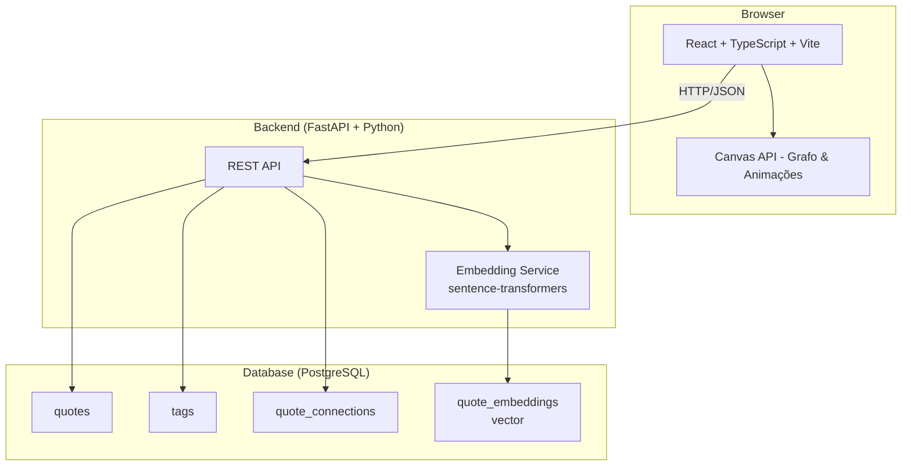
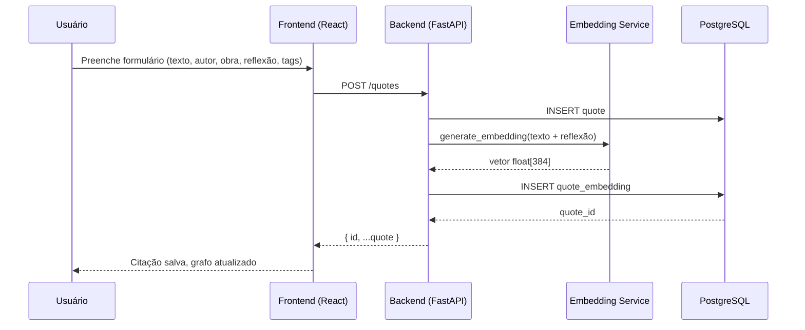
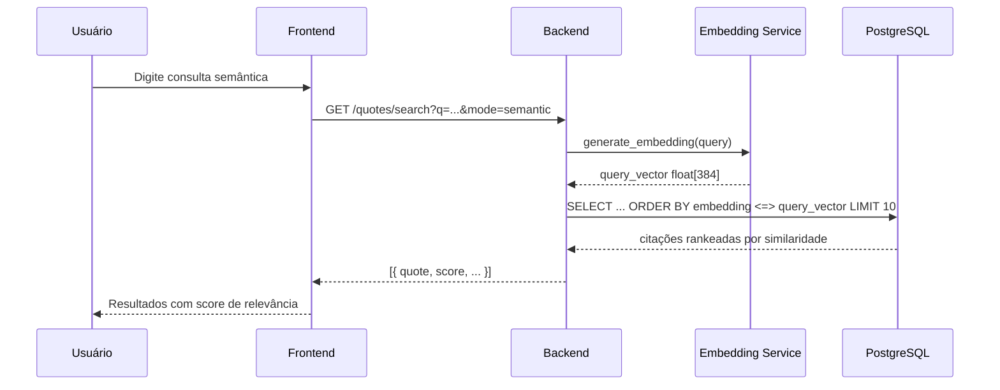
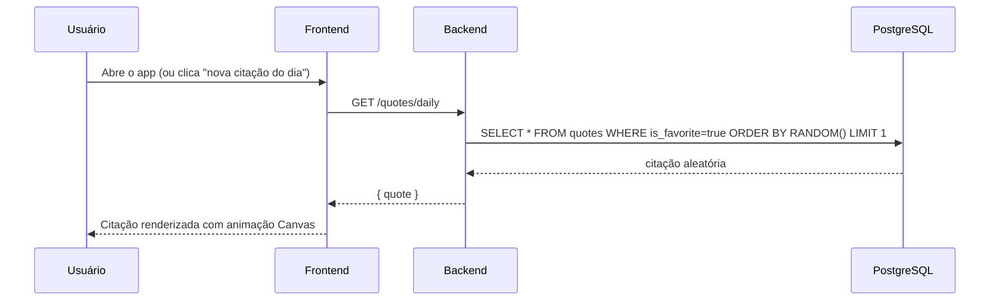
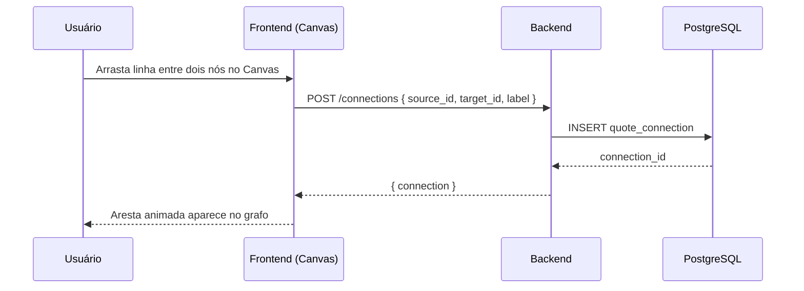

# Design Document: Philosophical Journal (Diário Filosófico)

## Overview

O Philosophical Journal é uma aplicação pessoal para centralizar estudos de filosofia e estoicismo. O usuário registra citações, reflexões e conexões entre ideias filosóficas, com busca semântica por significado e uma interface visual deslumbrante construída sobre a Canvas API do browser.

O diferencial da aplicação está na experiência visual: um grafo interativo de conexões entre citações renderizado em Canvas, animações suaves e elementos decorativos que evocam a estética de manuscritos filosóficos antigos combinados com design moderno. A busca semântica via sentence-transformers permite encontrar citações por significado, não apenas por palavras-chave.

A stack é React + TypeScript + Vite no frontend, FastAPI + Python no backend, PostgreSQL para persistência, e sentence-transformers para geração de embeddings vetoriais.

---

## Architecture



---

## Sequence Diagrams

### Salvar uma nova citação



### Busca semântica



### Citação do dia



### Conectar citações (grafo)



---

## Components and Interfaces

### Component 1: QuoteService (Backend)

**Purpose**: CRUD de citações, lógica de negócio central

**Interface**:
```typescript
interface Quote {
  id: string                  // UUID
  text: string                // Texto da citação
  author: string              // Autor
  work?: string               // Obra de origem
  reflection?: string         // Reflexão pessoal do usuário
  tags: Tag[]                 // Tags temáticas
  isFavorite: boolean         // Elegível para "citação do dia"
  createdAt: string           // ISO 8601
  updatedAt: string
}

interface CreateQuoteRequest {
  text: string
  author: string
  work?: string
  reflection?: string
  tagIds: string[]
  isFavorite?: boolean
}
```

**Responsibilities**:
- Criar, ler, atualizar e deletar citações
- Disparar geração de embedding após criação/edição
- Retornar citação aleatória favorita para "citação do dia"

---

### Component 2: EmbeddingService (Backend)

**Purpose**: Geração e busca por similaridade semântica

**Interface**:
```python
class EmbeddingService:
    def generate(self, text: str) -> list[float]: ...
    def search(self, query: str, limit: int = 10) -> list[QuoteSearchResult]: ...
```

**Responsibilities**:
- Carregar modelo sentence-transformers (`all-MiniLM-L6-v2`)
- Gerar embeddings de 384 dimensões
- Executar busca por similaridade coseno via pgvector

---

### Component 3: GraphCanvas (Frontend)

**Purpose**: Renderizar e interagir com o grafo de conexões entre citações usando Canvas API

**Interface**:
```typescript
interface GraphNode {
  id: string
  quoteId: string
  x: number
  y: number
  radius: number
  label: string        // Primeiras palavras da citação
  color: string        // Baseado nas tags
  velocity: { x: number; y: number }
}

interface GraphEdge {
  id: string
  sourceId: string
  targetId: string
  label?: string
  strength: number     // 0-1, espessura da linha
}

interface GraphCanvasProps {
  nodes: GraphNode[]
  edges: GraphEdge[]
  onNodeClick: (quoteId: string) => void
  onEdgeCreate: (sourceId: string, targetId: string) => void
  onNodeDrag: (nodeId: string, x: number, y: number) => void
}
```

**Responsibilities**:
- Renderizar nós e arestas com animações suaves (requestAnimationFrame)
- Simular física (force-directed layout) para posicionamento orgânico
- Detectar hover, click e drag nos nós
- Permitir criação de conexões por drag entre nós
- Renderizar partículas decorativas e efeitos de brilho

---

### Component 4: TagService (Backend)

**Purpose**: Gerenciamento de tags temáticas

**Interface**:
```typescript
interface Tag {
  id: string
  name: string         // ex: "virtude", "memento mori"
  color: string        // Hex color para visualização
  quoteCount: number
}
```

---

### Component 5: ConnectionService (Backend)

**Purpose**: Gerenciar conexões entre citações

**Interface**:
```typescript
interface QuoteConnection {
  id: string
  sourceQuoteId: string
  targetQuoteId: string
  label?: string       // Descrição da relação
  createdAt: string
}
```

---

## Data Models

### Model: quotes

```sql
CREATE TABLE quotes (
  id          UUID PRIMARY KEY DEFAULT gen_random_uuid(),
  text        TEXT NOT NULL,
  author      VARCHAR(255) NOT NULL,
  work        VARCHAR(255),
  reflection  TEXT,
  is_favorite BOOLEAN DEFAULT false,
  created_at  TIMESTAMPTZ DEFAULT NOW(),
  updated_at  TIMESTAMPTZ DEFAULT NOW()
);
```

**Validation Rules**:
- `text` não pode ser vazio, máximo 2000 caracteres
- `author` não pode ser vazio, máximo 255 caracteres
- `work` opcional, máximo 255 caracteres

---

### Model: tags

```sql
CREATE TABLE tags (
  id    UUID PRIMARY KEY DEFAULT gen_random_uuid(),
  name  VARCHAR(100) UNIQUE NOT NULL,
  color VARCHAR(7) NOT NULL DEFAULT '#8B7355'
);
```

---

### Model: quote_tags (relação N:N)

```sql
CREATE TABLE quote_tags (
  quote_id UUID REFERENCES quotes(id) ON DELETE CASCADE,
  tag_id   UUID REFERENCES tags(id) ON DELETE CASCADE,
  PRIMARY KEY (quote_id, tag_id)
);
```

---

### Model: quote_embeddings (pgvector)

```sql
CREATE EXTENSION IF NOT EXISTS vector;

CREATE TABLE quote_embeddings (
  quote_id  UUID PRIMARY KEY REFERENCES quotes(id) ON DELETE CASCADE,
  embedding vector(384) NOT NULL
);

CREATE INDEX ON quote_embeddings USING ivfflat (embedding vector_cosine_ops);
```

---

### Model: quote_connections

```sql
CREATE TABLE quote_connections (
  id         UUID PRIMARY KEY DEFAULT gen_random_uuid(),
  source_id  UUID REFERENCES quotes(id) ON DELETE CASCADE,
  target_id  UUID REFERENCES quotes(id) ON DELETE CASCADE,
  label      VARCHAR(255),
  created_at TIMESTAMPTZ DEFAULT NOW(),
  UNIQUE (source_id, target_id)
);
```

---

## API Endpoints

```
POST   /quotes                          Criar citação
GET    /quotes                          Listar citações (paginado, filtro por tag)
GET    /quotes/:id                      Buscar citação por ID
PUT    /quotes/:id                      Atualizar citação
DELETE /quotes/:id                      Deletar citação
GET    /quotes/daily                    Citação do dia (aleatória favorita)
GET    /quotes/search?q=&mode=          Busca (mode: text | semantic)
GET    /quotes/export?format=           Exportar (format: json | markdown)

POST   /tags                            Criar tag
GET    /tags                            Listar tags
DELETE /tags/:id                        Deletar tag

POST   /connections                     Criar conexão
GET    /connections                     Listar conexões (para o grafo)
DELETE /connections/:id                 Deletar conexão
```

---

## Low-Level Design

### Algoritmo: Busca Semântica

```pascal
ALGORITHM semanticSearch(query, limit)
INPUT: query: String, limit: Integer
OUTPUT: results: List<QuoteSearchResult>

PRECONDITIONS:
  - query IS NOT NULL AND query.length > 0
  - limit > 0 AND limit <= 100
  - EmbeddingService IS initialized with loaded model

BEGIN
  // Gerar embedding da query
  queryVector ← embeddingService.generate(query)
  ASSERT queryVector.length = 384

  // Buscar no banco por similaridade coseno
  results ← database.execute(
    "SELECT q.*, 1 - (e.embedding <=> $1) AS score
     FROM quotes q
     JOIN quote_embeddings e ON e.quote_id = q.id
     ORDER BY e.embedding <=> $1
     LIMIT $2",
    [queryVector, limit]
  )

  // Filtrar resultados com score mínimo
  filtered ← []
  FOR each result IN results DO
    IF result.score >= SIMILARITY_THRESHOLD (0.3) THEN
      filtered.append(result)
    END IF
  END FOR

  RETURN filtered
END
```

**Preconditions:**
- `query` é string não-vazia
- Modelo sentence-transformers carregado em memória
- Extensão pgvector instalada no PostgreSQL

**Postconditions:**
- Retorna lista ordenada por score decrescente
- Todos os resultados têm `score >= 0.3`
- Lista pode ser vazia se nenhum resultado atingir o threshold

**Loop Invariants:**
- Todos os itens em `filtered` têm `score >= SIMILARITY_THRESHOLD`

---

### Algoritmo: Force-Directed Graph Layout (Canvas)

```pascal
ALGORITHM forceDirectedStep(nodes, edges, dt)
INPUT: nodes: List<GraphNode>, edges: List<GraphEdge>, dt: Float
OUTPUT: nodes com posições atualizadas

PRECONDITIONS:
  - nodes.length > 0
  - dt > 0 AND dt <= 0.1  // passo de tempo estável

BEGIN
  // Calcular forças de repulsão entre todos os pares de nós
  FOR each nodeA IN nodes DO
    FOR each nodeB IN nodes WHERE nodeB.id != nodeA.id DO
      dx ← nodeA.x - nodeB.x
      dy ← nodeA.y - nodeB.y
      distance ← sqrt(dx² + dy²)
      
      IF distance < MIN_DISTANCE (1.0) THEN
        distance ← MIN_DISTANCE
      END IF
      
      repulsion ← REPULSION_CONSTANT (500) / distance²
      nodeA.velocity.x += (dx / distance) * repulsion * dt
      nodeA.velocity.y += (dy / distance) * repulsion * dt
    END FOR
  END FOR

  // Calcular forças de atração pelas arestas (mola)
  FOR each edge IN edges DO
    nodeA ← findNode(nodes, edge.sourceId)
    nodeB ← findNode(nodes, edge.targetId)
    
    dx ← nodeB.x - nodeA.x
    dy ← nodeB.y - nodeA.y
    distance ← sqrt(dx² + dy²)
    
    IF distance < MIN_DISTANCE THEN
      distance ← MIN_DISTANCE
    END IF
    
    attraction ← SPRING_CONSTANT (0.01) * (distance - REST_LENGTH (150))
    force.x ← (dx / distance) * attraction
    force.y ← (dy / distance) * attraction
    
    nodeA.velocity.x += force.x * dt
    nodeA.velocity.y += force.y * dt
    nodeB.velocity.x -= force.x * dt
    nodeB.velocity.y -= force.y * dt
  END FOR

  // Aplicar amortecimento e atualizar posições
  FOR each node IN nodes DO
    node.velocity.x *= DAMPING (0.85)
    node.velocity.y *= DAMPING (0.85)
    node.x += node.velocity.x
    node.y += node.velocity.y
    
    // Manter dentro dos limites do canvas
    node.x ← clamp(node.x, node.radius, canvasWidth - node.radius)
    node.y ← clamp(node.y, node.radius, canvasHeight - node.radius)
  END FOR

  RETURN nodes
END
```

**Preconditions:**
- Todos os nós têm posição inicial definida
- `dt` é pequeno o suficiente para estabilidade numérica

**Postconditions:**
- Todos os nós permanecem dentro dos limites do canvas
- Velocidades são amortecidas (sistema converge)
- Nós conectados tendem a se aproximar; não conectados se repelem

**Loop Invariants (repulsão):**
- Para cada par processado, a força é simétrica e oposta
- `distance >= MIN_DISTANCE` sempre (evita divisão por zero)

---

### Algoritmo: Renderização Canvas (Loop Principal)

```pascal
ALGORITHM renderLoop(canvas, state)
INPUT: canvas: HTMLCanvasElement, state: GraphState
OUTPUT: frame renderizado

BEGIN
  ctx ← canvas.getContext("2d")
  
  // Limpar frame anterior
  ctx.clearRect(0, 0, canvas.width, canvas.height)
  
  // Renderizar fundo com gradiente sutil
  renderBackground(ctx, canvas)
  
  // Renderizar partículas decorativas
  FOR each particle IN state.particles DO
    particle.alpha ← sin(particle.age * PI / particle.lifetime)
    ctx.globalAlpha ← particle.alpha * 0.3
    ctx.fillStyle ← PARTICLE_COLOR
    ctx.beginPath()
    ctx.arc(particle.x, particle.y, particle.radius, 0, 2 * PI)
    ctx.fill()
    particle.age += 1
  END FOR
  ctx.globalAlpha ← 1.0
  
  // Renderizar arestas (abaixo dos nós)
  FOR each edge IN state.edges DO
    nodeA ← findNode(state.nodes, edge.sourceId)
    nodeB ← findNode(state.nodes, edge.targetId)
    
    ctx.beginPath()
    ctx.moveTo(nodeA.x, nodeA.y)
    
    // Curva de Bezier para arestas elegantes
    midX ← (nodeA.x + nodeB.x) / 2
    midY ← (nodeA.y + nodeB.y) / 2 - 30
    ctx.quadraticCurveTo(midX, midY, nodeB.x, nodeB.y)
    
    ctx.strokeStyle ← EDGE_COLOR_WITH_ALPHA(0.4)
    ctx.lineWidth ← 1 + edge.strength * 2
    ctx.stroke()
    
    // Label da aresta
    IF edge.label IS NOT NULL THEN
      renderEdgeLabel(ctx, edge, nodeA, nodeB)
    END IF
  END FOR
  
  // Renderizar nós
  FOR each node IN state.nodes DO
    // Sombra/glow
    ctx.shadowColor ← node.color
    ctx.shadowBlur ← IF node.isHovered THEN 20 ELSE 8
    
    // Círculo principal
    ctx.beginPath()
    ctx.arc(node.x, node.y, node.radius, 0, 2 * PI)
    ctx.fillStyle ← node.color
    ctx.fill()
    
    // Borda
    ctx.strokeStyle ← lighten(node.color, 0.3)
    ctx.lineWidth ← 2
    ctx.stroke()
    
    ctx.shadowBlur ← 0
    
    // Label truncado
    renderNodeLabel(ctx, node)
  END FOR
  
  // Agendar próximo frame
  requestAnimationFrame(() => renderLoop(canvas, state))
END
```

---

### Algoritmo: Geração de Embedding (Backend)

```pascal
ALGORITHM generateEmbedding(text)
INPUT: text: String
OUTPUT: embedding: List<Float> de tamanho 384

PRECONDITIONS:
  - text IS NOT NULL AND text.length > 0
  - model IS loaded (SentenceTransformer("all-MiniLM-L6-v2"))

BEGIN
  // Truncar texto se necessário (modelo tem limite de tokens)
  truncated ← text[:512] IF text.length > 512 ELSE text
  
  // Gerar embedding
  embedding ← model.encode(truncated, normalize_embeddings=true)
  
  ASSERT embedding.shape = (384,)
  ASSERT all(-1.0 <= v <= 1.0 FOR v IN embedding)  // normalizado
  
  RETURN embedding.tolist()
END
```

**Preconditions:**
- Modelo carregado em memória (lazy loading na inicialização do serviço)
- `text` não é vazio

**Postconditions:**
- Retorna lista de 384 floats
- Valores normalizados (norma L2 = 1.0)
- Determinístico para o mesmo input

---

### Algoritmo: Exportação por Tema

```pascal
ALGORITHM exportByTheme(format)
INPUT: format: Enum("json" | "markdown")
OUTPUT: exportedContent: String

BEGIN
  // Buscar todas as tags com suas citações
  tagsWithQuotes ← database.query(
    "SELECT t.name, t.color, q.*
     FROM tags t
     JOIN quote_tags qt ON qt.tag_id = t.id
     JOIN quotes q ON q.id = qt.quote_id
     ORDER BY t.name, q.author"
  )
  
  // Agrupar por tag
  grouped ← {}
  FOR each row IN tagsWithQuotes DO
    IF row.tag_name NOT IN grouped THEN
      grouped[row.tag_name] ← []
    END IF
    grouped[row.tag_name].append(row.quote)
  END FOR
  
  IF format = "markdown" THEN
    content ← "# Diário Filosófico\n\n"
    FOR each (tagName, quotes) IN grouped DO
      content += "## " + tagName + "\n\n"
      FOR each quote IN quotes DO
        content += "> " + quote.text + "\n"
        content += "— " + quote.author
        IF quote.work IS NOT NULL THEN
          content += ", *" + quote.work + "*"
        END IF
        content += "\n\n"
        IF quote.reflection IS NOT NULL THEN
          content += "**Reflexão:** " + quote.reflection + "\n\n"
        END IF
      END FOR
    END FOR
    RETURN content
  ELSE  // json
    RETURN JSON.stringify(grouped, indent=2)
  END IF
END
```

---

## Key Functions with Formal Specifications

### `POST /quotes` — Criar citação

**Preconditions:**
- `text` não vazio, `author` não vazio
- `tagIds` é lista de UUIDs válidos existentes no banco

**Postconditions:**
- Citação persistida no banco com `id` gerado
- Embedding gerado e salvo em `quote_embeddings`
- Retorna status 201 com o objeto criado

**Side Effects:**
- Insere em `quotes`, `quote_tags`, `quote_embeddings`

---

### `GET /quotes/search` — Busca

**Preconditions:**
- `q` não vazio
- `mode` é `"text"` ou `"semantic"`

**Postconditions:**
- Se `mode=text`: busca por `ILIKE` em `text`, `author`, `reflection`
- Se `mode=semantic`: retorna citações ordenadas por similaridade coseno
- Resultados sempre incluem tags associadas

---

### `GraphCanvas.addConnection(sourceId, targetId)` — Criar aresta

**Preconditions:**
- `sourceId !== targetId`
- Conexão entre os dois nós não existe ainda

**Postconditions:**
- Nova aresta adicionada ao estado local do grafo
- `POST /connections` disparado em background
- Animação de "surgimento" da aresta executada

---

## Error Handling

### Erro: Modelo de embedding não carregado

**Condition**: Requisição de busca semântica antes do modelo inicializar
**Response**: HTTP 503 com `{ "error": "Embedding service initializing, try again in a few seconds" }`
**Recovery**: Retry automático no frontend após 2 segundos

---

### Erro: Citação sem favoritas para "citação do dia"

**Condition**: Nenhuma citação com `is_favorite=true`
**Response**: HTTP 200 com citação aleatória de qualquer citação (fallback)
**Recovery**: Retorna citação aleatória do pool geral

---

### Erro: Conexão duplicada no grafo

**Condition**: Tentativa de criar conexão já existente
**Response**: HTTP 409 com `{ "error": "Connection already exists" }`
**Recovery**: Frontend ignora silenciosamente e mantém estado atual

---

### Erro: pgvector não instalado

**Condition**: Extensão `vector` não disponível no PostgreSQL
**Response**: HTTP 500 com log detalhado
**Recovery**: Script de migração inclui `CREATE EXTENSION IF NOT EXISTS vector`

---

## Testing Strategy

### Unit Testing Approach

- **Backend**: pytest para todos os endpoints FastAPI, com banco de dados em memória (SQLite para testes simples, PostgreSQL em Docker para testes de integração)
- **Frontend**: Vitest + React Testing Library para componentes React
- **Canvas**: Testes unitários das funções de física (force-directed) com valores determinísticos

### Property-Based Testing Approach

**Property Test Library**: Hypothesis (Python) para backend, fast-check (TypeScript) para frontend

Propriedades a testar:
- `generate_embedding(text)` sempre retorna vetor de tamanho 384
- `generate_embedding(text)` é determinístico para o mesmo input
- `forceDirectedStep(nodes, edges, dt)` nunca posiciona nós fora dos limites do canvas
- Busca semântica com query vazia retorna lista vazia (nunca lança exceção)
- Exportação markdown sempre contém todas as citações do banco

### Integration Testing Approach

- Testes end-to-end do fluxo: criar citação → gerar embedding → buscar semanticamente → encontrar citação
- Testes do grafo: criar nós → criar conexões → verificar layout force-directed converge

---

## Performance Considerations

- **Embedding lazy loading**: O modelo sentence-transformers (~90MB) é carregado uma vez na inicialização do serviço, não por requisição
- **Índice ivfflat**: O índice vetorial no PostgreSQL garante busca semântica em O(log n) ao invés de O(n)
- **Canvas requestAnimationFrame**: O loop de renderização usa `requestAnimationFrame` para sincronizar com o refresh rate do monitor e pausar quando a aba não está visível
- **Simulação física**: O force-directed layout para de simular quando a energia cinética total cai abaixo de um threshold (grafo "esfria")
- **Paginação**: Listagem de citações paginada (20 por página) para evitar carregar todo o banco

---

## Security Considerations

- **Aplicação pessoal**: Sem autenticação multi-usuário; se necessário, proteger com variável de ambiente `API_KEY` simples
- **SQL Injection**: Uso exclusivo de queries parametrizadas via SQLAlchemy ORM
- **CORS**: Backend configurado para aceitar apenas origem do frontend local
- **Tamanho de input**: Limite de 2000 caracteres no texto da citação para evitar embeddings de textos absurdamente longos

---

## Dependencies

### Backend
- `fastapi` — Framework web
- `uvicorn` — ASGI server
- `sqlalchemy` + `asyncpg` — ORM e driver PostgreSQL async
- `sentence-transformers` — Geração de embeddings semânticos
- `pgvector` — Extensão PostgreSQL + cliente Python para busca vetorial
- `alembic` — Migrações de banco de dados
- `pydantic` — Validação de dados e schemas

### Frontend
- `react` + `react-dom` — UI framework
- `typescript` — Tipagem estática
- `vite` — Build tool e dev server
- `react-router-dom` — Roteamento
- `@tanstack/react-query` — Cache e sincronização de estado servidor
- `axios` — Cliente HTTP

### Infrastructure
- `PostgreSQL 15+` com extensão `pgvector`
- `Docker` + `docker-compose` para desenvolvimento local

---

## Correctness Properties

*Uma propriedade é uma característica ou comportamento que deve ser verdadeiro em todas as execuções válidas do sistema — essencialmente, uma declaração formal sobre o que o sistema deve fazer. As propriedades servem como ponte entre especificações legíveis por humanos e garantias de corretude verificáveis por máquina.*

### Property 1: Round-trip de criação de citação

*Para qualquer* citação com `text` não-vazio e `author` não-vazio, criar a citação via `POST /quotes` e depois buscá-la via `GET /quotes/:id` deve retornar um objeto com os mesmos valores de `text`, `author`, `work`, `reflection` e `isFavorite` fornecidos na criação.

**Validates: Requirements 1.1, 1.4**

---

### Property 2: Embedding gerado após criação de citação

*Para qualquer* citação criada com sucesso, o registro em `quote_embeddings` associado deve conter um vetor de exatamente 384 floats.

**Validates: Requirements 1.2, 8.1**

---

### Property 3: Paginação da listagem de citações

*Para qualquer* conjunto de N citações no banco (N > 0), a listagem via `GET /quotes` deve retornar páginas com no máximo 20 itens cada, e a soma de itens em todas as páginas deve ser igual a N.

**Validates: Requirements 1.3**

---

### Property 4: Deleção em cascata de citação

*Para qualquer* citação deletada via `DELETE /quotes/:id`, buscar essa citação por ID deve retornar HTTP 404, e não deve existir nenhum embedding, tag-associação ou conexão referenciando o ID deletado.

**Validates: Requirements 1.6**

---

### Property 5: Validação de campos obrigatórios na criação de citação

*Para qualquer* requisição de criação de citação onde `text` seja vazio, nulo ou exceda 2000 caracteres, ou onde `author` seja vazio ou nulo, o QuoteService deve rejeitar a requisição com HTTP 422.

**Validates: Requirements 1.7, 1.8, 1.9**

---

### Property 6: Busca textual retorna apenas resultados relevantes

*Para qualquer* conjunto de citações no banco e qualquer termo de busca não-vazio com `mode=text`, todos os resultados retornados devem conter o termo (case-insensitive) em pelo menos um dos campos `text`, `author` ou `reflection`.

**Validates: Requirements 2.1**

---

### Property 7: Busca semântica: ordenação, threshold e limite

*Para qualquer* consulta semântica não-vazia com `mode=semantic`, os resultados devem estar ordenados por score decrescente, todos os scores devem ser >= 0.3, e o número de resultados não deve exceder 10.

**Validates: Requirements 2.2, 2.3, 2.4**

---

### Property 8: Citação do dia pertence ao pool de favoritos

*Para qualquer* banco de dados com pelo menos uma citação com `is_favorite = true`, a resposta de `GET /quotes/daily` deve sempre retornar uma citação cujo campo `isFavorite` seja `true`.

**Validates: Requirements 3.1**

---

### Property 9: quoteCount reflete associações reais

*Para qualquer* conjunto de tags e citações, o campo `quoteCount` retornado por `GET /tags` para cada tag deve ser igual ao número exato de citações associadas a essa tag no banco de dados.

**Validates: Requirements 4.2**

---

### Property 10: Deleção de tag não deleta citações

*Para qualquer* tag deletada via `DELETE /tags/:id`, todas as citações que estavam associadas a essa tag devem continuar existindo no banco de dados e acessíveis via `GET /quotes/:id`.

**Validates: Requirements 4.3**

---

### Property 11: Validação de cor hexadecimal de tag

*Para qualquer* string que não corresponda ao padrão `#RRGGBB` (6 dígitos hexadecimais precedidos de `#`), a criação de tag deve ser rejeitada com HTTP 422.

**Validates: Requirements 4.5**

---

### Property 12: Round-trip de conexões entre citações

*Para qualquer* par de citações distintas (source_id ≠ target_id), criar uma conexão via `POST /connections` e depois listar via `GET /connections` deve incluir a conexão criada com os IDs corretos. Deletar a conexão via `DELETE /connections/:id` e listar novamente não deve incluí-la.

**Validates: Requirements 5.1, 5.2, 5.3**

---

### Property 13: Exportação contém todas as citações

*Para qualquer* banco de dados com N citações, a exportação via `GET /quotes/export?format=json` deve retornar um JSON deserializável cujo total de citações (somando todos os grupos por tag) seja igual a N. A exportação via `format=markdown` deve conter o texto de cada citação exatamente uma vez por tag associada.

**Validates: Requirements 6.1, 6.2, 6.3**

---

### Property 14: Nós do grafo permanecem dentro dos limites do canvas

*Para qualquer* conjunto de nós com posições iniciais válidas, qualquer conjunto de arestas e qualquer passo de tempo `dt` no intervalo (0, 0.1], após cada iteração do algoritmo `forceDirectedStep` todos os nós devem ter coordenadas dentro dos limites `[radius, canvasWidth - radius]` × `[radius, canvasHeight - radius]`.

**Validates: Requirements 7.3**

---

### Property 15: Amortecimento de velocidade no force-directed layout

*Para qualquer* nó com velocidade inicial `(vx, vy)`, após uma iteração do algoritmo `forceDirectedStep` (desconsiderando forças externas), a velocidade do nó deve ser `(vx * 0.85, vy * 0.85)` antes da atualização de posição.

**Validates: Requirements 7.4**

---

### Property 16: Callbacks do GraphCanvas invocados com valores corretos

*Para qualquer* conjunto de nós no grafo, clicar em um nó deve invocar `onNodeClick` com o `quoteId` exato daquele nó; arrastar entre dois nós distintos deve invocar `onEdgeCreate` com os IDs corretos de origem e destino; arrastar um nó deve invocar `onNodeDrag` com o `nodeId` e as coordenadas de destino corretas.

**Validates: Requirements 7.6, 7.7, 7.8**

---

### Property 17: Invariantes do embedding gerado

*Para qualquer* texto não-vazio, o EmbeddingService deve: (a) retornar sempre um vetor de exatamente 384 floats; (b) retornar vetores idênticos para o mesmo texto (determinismo); (c) retornar um vetor com norma L2 igual a 1.0 (com tolerância de 1e-5).

**Validates: Requirements 8.1, 8.2, 8.3**

---

### Property 18: Truncamento de texto longo para embedding

*Para qualquer* texto com comprimento > 512 caracteres, o embedding gerado deve ser idêntico ao embedding gerado para os primeiros 512 caracteres desse texto.

**Validates: Requirements 8.4**

---

### Property 19: Round-trip de serialização de objetos de domínio

*Para qualquer* objeto `Quote`, `Tag` ou `QuoteConnection` válido, serializar para JSON e deserializar deve produzir um objeto equivalente com todos os campos definidos nas respectivas interfaces preservados sem perda de dados.

**Validates: Requirements 9.1, 9.2, 9.3, 9.4**

---

### Property 20: Autenticação via API key

*Para qualquer* requisição HTTP ao backend quando a variável de ambiente `API_KEY` estiver definida e a requisição não incluir a API key correta, o backend deve retornar HTTP 401 ou HTTP 403.

**Validates: Requirements 10.3**
